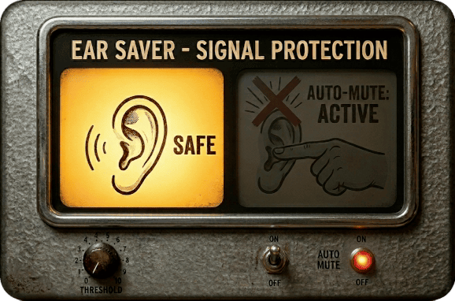

# EarSaver

LV2 utility plugin for MOD Dwarf that automatically mutes audio 
when the signal exceeds a threshold — protecting your ears when 
trying unknown plugins that suddenly screech into your headphones.

## Controls

- **Threshold** (0.0 - 1.0): Signal level at which muting is triggered

## Building

Produced with [Plugdata](https://plugdata.org/) and the 
[hvcc](https://github.com/Wasted-Audio/hvcc) compiler.

This plugin is built for MOD Dwarf using the 
[MOD Cloud Builder](https://builder.mod.audio/).
Building for other platforms is not currently supported.

## License

GPL-3.0 — see [LICENSE](LICENSE)

## Author

sensorium — https://github.com/sensorium